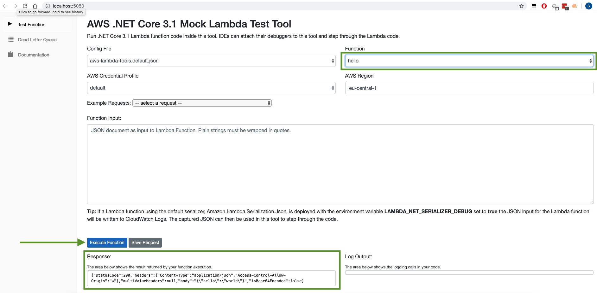

# serverlessDotNetStarter

This template is meant as a starter template for serverless framework with following scope:

- deploy C# / NET Core 3.1 solution in **AWS cloud** using:
  - Lambda
  - Api Gateway
- debug and test solution locally in **Visual Studio Code**
- works operating system independent

## Prerequisites to install

- [NodeJS](https://nodejs.org/en/)
- [Serverless Framework CLI](https://serverless.com)
- [.NET Core 3.1](https://dotnet.microsoft.com/download/dotnet-core/3.1)
- [AWS-Lambda-DotNet](https://github.com/aws/aws-lambda-dotnet)
- [Visual Studio Code](https://code.visualstudio.com/)
- [C# Extension for Visual Studio Code](https://marketplace.visualstudio.com/items?itemName=ms-vscode.csharp)

Verify that everything is installed (copy & paste)

```bash
# package manager for nodejs
npm -v
# serverless framework cli > 1.5
sls -v
# dotnet (cli) > 3.1
dotnet --version
```

## Installation (copy & paste)

```bash
# clone solution
# serverless create --template-url https://github.com/pharindoko/serverlessDotNetStarter --path {SERVICE_NAME}
serverless create --template-url https://github.com/pharindoko/serverlessDotNetStarter --path serverlessDotnetstarter
cd serverlessDotNetStarter
# restore / install dotnet references described in csproj file
dotnet restore AwsDotnetCsharp.csproj

# install Lambda NET Mock Test Tool and Amazon Lambda Tools
# more details: https://github.com/aws/aws-lambda-dotnet/tree/master/Tools/LambdaTestTool

dotnet tool install -g Amazon.Lambda.Tools
dotnet tool install --global Amazon.Lambda.TestTool-3.1
dotnet tool list -g

# expected dotnet packages:
#
# Package Id                      Version      Commands
------------------------------------------------------------------------
#amazon.lambda.testtool-3.1      0.10.0       dotnet-lambda-test-tool-3.1
#amazon.lambda.tools             4.0.0        dotnet-lambda
```

**For VS Code Debugging:**

> ```bash
> code --install-extension ms-dotnettools.csharp
> ```

## Debug & Test locally

I followed this guideline: (Please read in case of issues)

[How to Debug .NET Core Lambda Functions Locally with the Serverless Framework](https://itnext.io/how-to-debug-net-core-lambda-functions-locally-with-the-serverless-framework-dd1670bc22e2)

#### 1. Open Visual Studio Code

```bash
# open Visual Studio Code
code .
```

#### 2. Edit property in .vscode/launch.json file (placeholders marked version bold)
You need to set 
 - the correct {user} in the file path
 - the right toolversion (see below -> how to get the right tool version ?)


  <pre><code>
  "program": "/Users/<b>{user}</b>/.dotnet/tools/.store/amazon.lambda.testtool-3.1/<b>{Set toolversion}</b>/amazon.lambda.testtool-3.1/<b>{Set toolVersion}</b>/tools/netcoreapp3.1/any/Amazon.Lambda.TestTool.WebTester31.dll",

# sample: 
# /Users/user123/.dotnet/tools/.store/amazon.lambda.testtool-3.1/0.10.0/amazon.lambda.testtool-3.1/0.10.0/tools/netcoreapp3.1/any/Amazon.Lambda.TestTool.WebTester31.dll",
</pre></code>


> **how to get the right tool version ?**

  <pre><code>
   dotnet tool list -g

   Result:
    Package Id                      Version                   Commands                   
    ------------------------------------------------------------------------
    amazon.lambda.testtool-3.1      <b>e.g. version 0.10.0</b>       dotnet-lambda-test-tool-3.1
  </pre></code>

#### 3. Press **F5** to start the debugging and local testing of lambda function

- Hint: Lambda Mock Test Tool should be started locally on port 5050
- Click on Button "Execute Function"



> you should get hello world as a result.

#### Test Another Example: getquerystring

1. Select function to **getquerystring** (upper right dropdownlist)
2. Insert this json value in the function input textbox for a first test:


    ```json
    {
      "httpMethod": "GET",
      "queryStringParameters": {
        "foo": "dfgdfg",
        "woot": "food"
      }
    }
    ```

> **Mind:** For a successful response querystringParameter **foo** must be inserted

## Build Package

Mac OS or Linux

```bash
./build.sh
```

Windows

```bash
build.cmd
```

## Deploy via Serverless Framework

```bash
serverless deploy
```

A cloudformation stack in AWS will be created in background containing all needed resources

#### After successful deployment you can see following output

<pre>
Service Information
service: myService
stage: dev
region: <b>us-east-1</b>
stack: myService-dev
resources: 10
api keys:
  None
endpoints:
  GET - <b>endpointUrl --> https://{api}.execute-api.us-east-1.amazonaws.com/dev/hello</b>
functions:
  hello: myService-dev-hello
layers:
  None

</pre>

## Test endpoint after deployment

2 simple options:

- [Use postman as UI Tool](https://www.getpostman.com/)
- Use curl

Use the **endpointUrl** from up above.

```bash
curl https://{api}.execute-api.us-east-1.amazonaws.com/dev/hello
curl https://{api}.execute-api.us-east-1.amazonaws.com/dev/getquerystring?foo=test
```

**Mind:** For a successful response of function getquerystring the querystringParameter **foo** must be inserted

## FAQ

###### Can I use the solution with Visual Studio IDE (2017 or 2019)

1. Yes. [Here`s the guideline.](https://github.com/aws/aws-lambda-dotnet/tree/master/Tools/LambdaTestTool#configure-for-visual-studio)

###### How to add an api key

1. Setup API Key in serverless.yml file
   https://serverless.com/framework/docs/providers/aws/events/apigateway/#setting-api-keys-for-your-rest-api

###### How to add additional lambda functions

1. Create a new C# Function in Handler.cs or use another file
2. Add a new function to serverless.yml and reference the C# Function as handler
   https://serverless.com/framework/docs/providers/aws/guide/functions/

###### Destroy the stack in the cloud

```bash
sls remove
```

###### I deployed the solution but I get back a http 500 error

1. Check Cloudwatch Logs in AWS - the issue should be describe there.
2. For a successful response of function getquerystring the querystringParameter **foo** must be inserted

###### How can I change the lambda region or stack name

Please have a look to the serverless guideline: https://serverless.com/framework/docs/providers/aws/guide/deploying/
